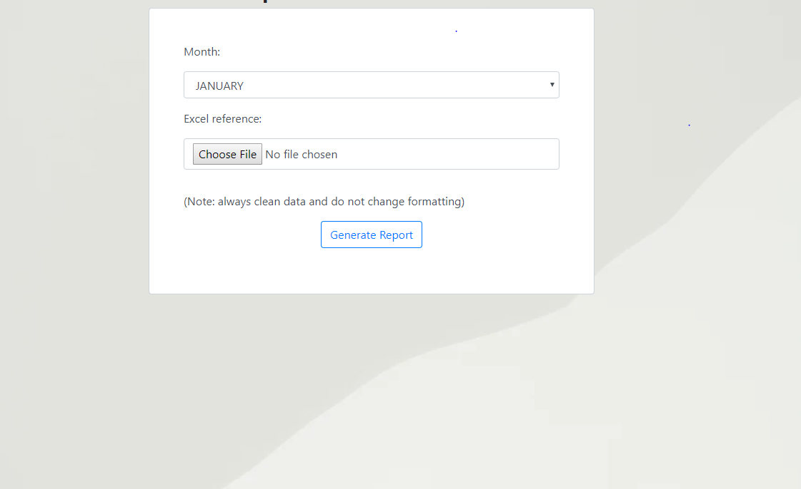

# Django Based App for Generating Report Inside a Sheet of an Uploaded Excel File ( additional view of dataframes and plots in html )

# Who is this for

For people that want to simplify or speed up their reporting in excel that is required by their respective companies. The requirements.txt contains mostly everything that you want to use to generate this kinds of reports with just a few clicks. Probably save time if you are asked to generate reports on a daily basis while only updating your excel files. 

# Goal

Generate a file that can be downloaded into any machine ( cross platform ) that contains a new sheet dedicated for the report generation.
Also generate html view of the whole report for better human viewing. ( This solves the problem of hard scrolling and grids present in viewing it in excel or even ods )

# Limitations

I have removed the "business logic" functions of the app for privacy reasons. The case of the app is very specific into a one type of format and depends on the excel file not being altered.
This pseudo code works on a small group of people that uses the specific app, it probably can't handle larger people accessing it at the same time ( I haven't tested it but if you want to serve larger group of people see *celery ).
This probably can be done through some excel functions and macros, but for computers with limited capabilities, the excel file would load so slow because of having too many functions at the same time. I haven't used chunks for saving excel files larger than 2.5mb, but the logic stays the same within my views.py so it is usable even with very large excel files and python computes it at a relatively fast pace compared to excel/ods.
I haven't touched the models.py as I designed all the logic to be present only in the views so that I don't mess with the sql and database a lot ( avoiding database issued )

If you want to learn or need a similar type of project, please message me thorugh atienza.new@gmail.com

p.s. no i don't do it for free
p.s. no, i don't charge high, just email me

# Preview

